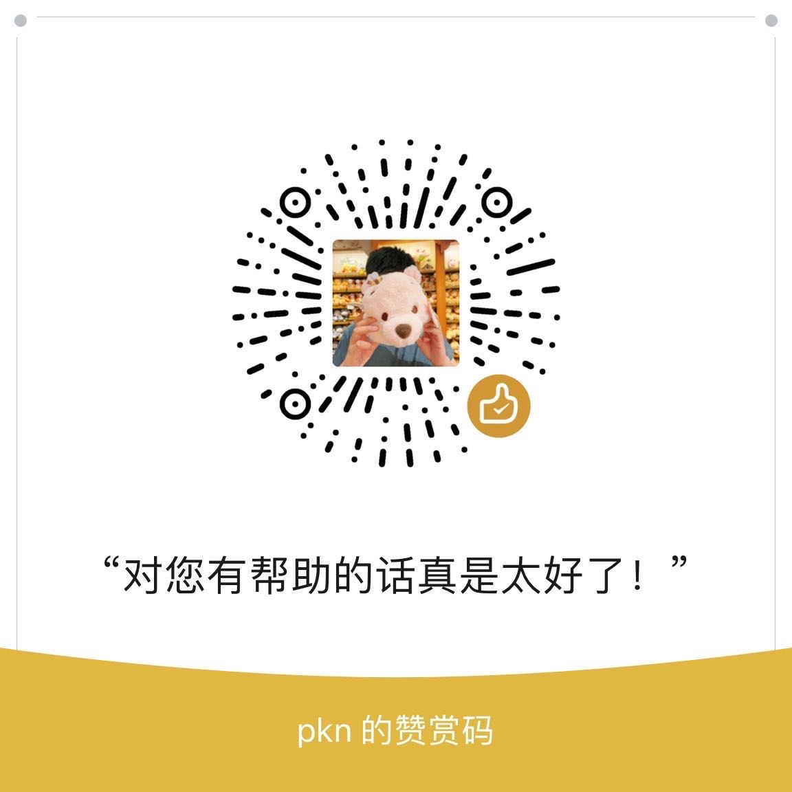

# ChatRobot

本服务使用golang进行开发
网页测试地址：http://101.43.177.135:9999/

程序使用了微软认知服务的SpeechToText以及TextToSpeech对语音和文字进行相互转换，该ApiKey已经写入到服务中不需要填写
调用OpenApi服务仍需要输入ApiKey

针对没有ApiKey的用户提供一个试用key, 使用key已集成到服务中，
若没有自己的key在输入页面直接 输入空值即可
当余额使用完之后该key失效，请各位仅限试用，让更多的人有机会体验

# 使用注意事项

由于没有使用ssl协议，浏览器调用媒体组件需要给该地址加浏览器白名单，否则会导致网页无法正常运行

可以用以下方法加白名单

地址栏输入chrome://flags/, 搜索unsafely

enabled 并填入要授信的域名

其他浏览器可参考：http://events.jianshu.io/p/58a0d4421313

# 使用方法

1. ChatGPT调教指南：https://www.w3cschool.cn/openai_doc/openai_doc-vw723r6a.html
    - 你可以根据调教指南中的语句设置机器人对话场景
2. Azure语言模型可参考：https://learn.microsoft.com/zh-cn/azure/cognitive-services/speech-service/language-support?tabs=tts

# 支持

如果本代码对你有帮助，请多多star

